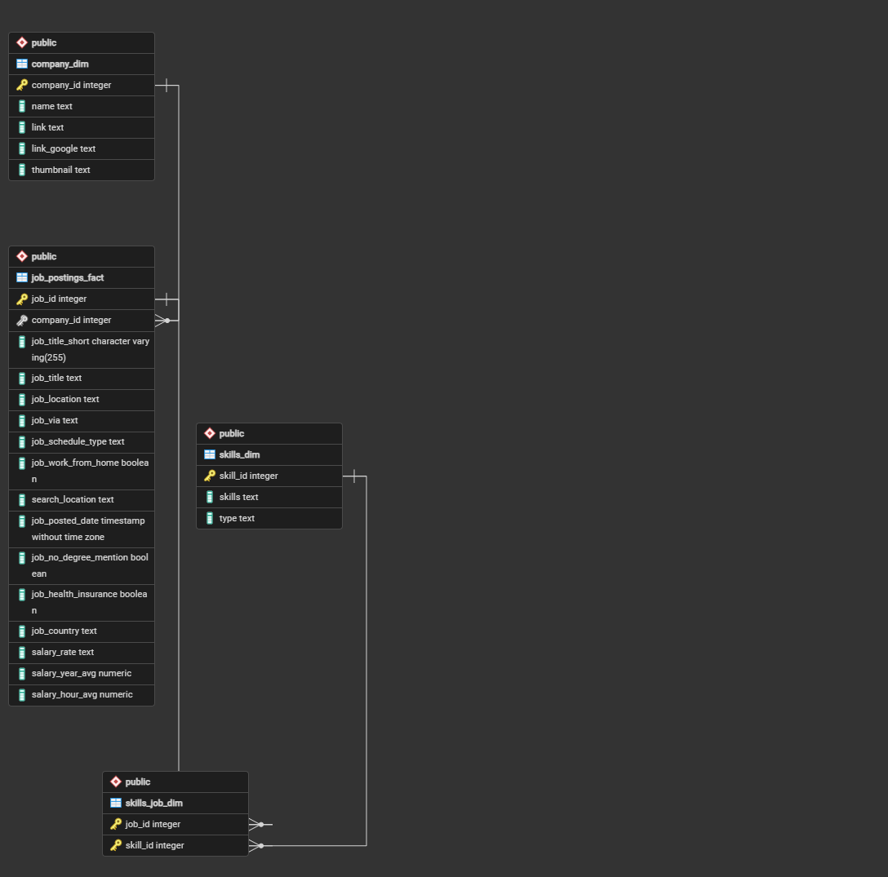
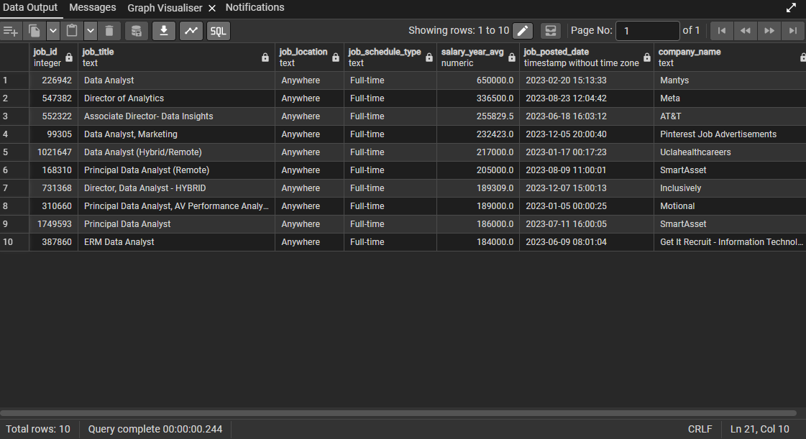
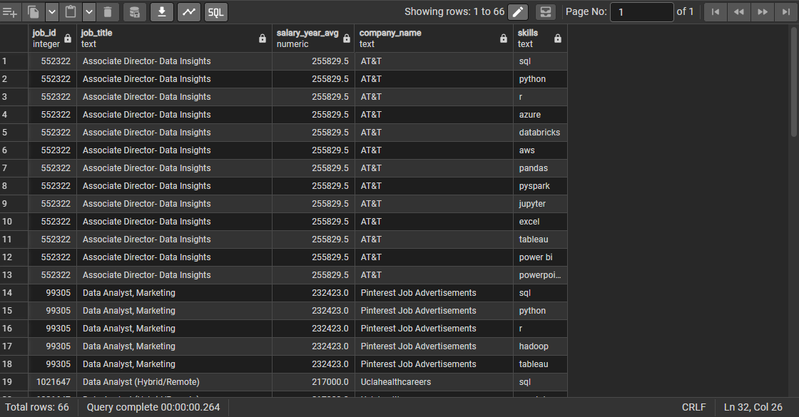
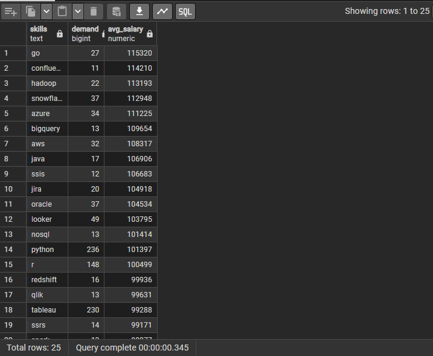
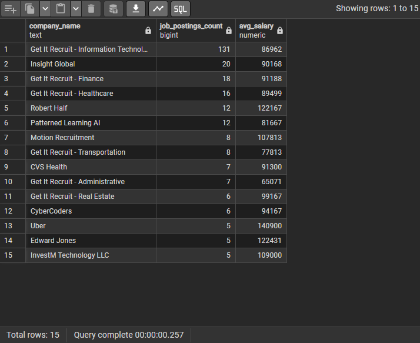
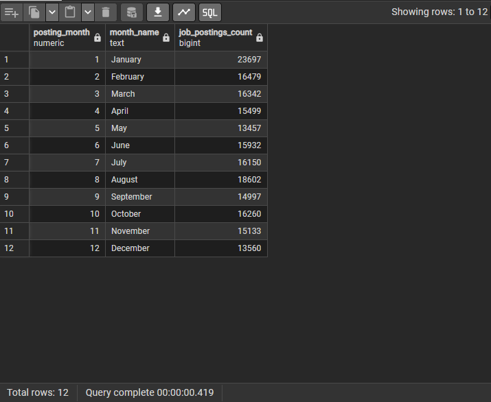

# 📊 Data Analyst Job Market Analysis (SQL)

An analysis of the 2023 data analyst job market using PostgreSQL. This project explores top-paying roles, required skills, and hiring trends to help job seekers make smarter career decisions.

---

## 🛠️ Tools Used

- **PostgreSQL** — database and querying
- **pgAdmin** — query execution and result visualization
- **Git & GitHub** — version control

---

## 📁 Project Structure

```
sql_job_market_analysis/
├── Queries/        ← SQL query files
├── Results/        ← CSV exports of query outputs
├── Assets/         ← screenshots of query results
└── README.md
```

---

## 🗄️ Database Schema



The dataset contains 4 tables: `job_postings_fact`, `company_dim`, `skills_dim`, and `skills_job_dim`.

---

## 📌 Analysis & Findings

### 1. Top 10 Highest Paying Remote Data Analyst Jobs

```sql
-- See Queries/Top_paying_jobs.sql
```



**Finding:** The highest paying remote Data Analyst role offered **$650,000/year** at Mantys. The top 10 roles range between **$184,000 and $650,000**, with Meta ($336,500), AT&T ($255,829), and SmartAsset appearing multiple times — consistent high-paying employers in this space.

---

### 2. Skills Required for Top Paying Jobs

```sql
-- See Queries/Top_paying_job_skills.sql
```



**Finding:** Across the top 10 highest paying roles, **66 skill-job combinations** were found. SQL, Python, and Tableau appeared most frequently. Cloud tools like AWS, Azure, and Databricks also appeared consistently — signaling that cloud knowledge is expected at senior, high-paying levels.

---

### 3. Most Optimal Skills to Learn (High Demand + High Pay)

```sql
-- See Queries/Most_optimal_skills.sql
```



**Finding:** Sorting by salary, **Go ($115,320)** and **Snowflake ($112,948)** top the list. But **Python (demand: 236) and Tableau (demand: 230)** offer the best balance of high demand and strong salaries (~$100K) — making them the most practical skills to prioritize for job security and pay.

---

### 4. Companies With Most Remote Job Postings

```sql
-- See Queries/Company_job_count_salary.sql
```



**Finding:** **Get It Recruit - Information Technology** posted the most remote Data Analyst jobs (131 postings) but averaged only $86,962. In contrast, **Uber** posted just 5 jobs but averaged **$140,900**. High posting volume and high salary don't always go together — target companies like Uber, Robert Half ($122,167), and Edward Jones ($122,431) for the best combination of opportunity and pay.

---

### 5. Monthly Hiring Trends in 2023

```sql
-- See Queries/Monthly_posting_trend.sql
```



**Finding:** **January had the highest postings at 23,697** — nearly 44% more than any other month. A secondary spike occurs in **August (18,602)**. December was the slowest at 13,560. Best windows to apply: **January and August**.

---

## 🔑 Key Takeaways

- **SQL and Python are non-negotiable** — they appear in nearly every high-paying role
- **Cloud skills (AWS, Azure, Snowflake) significantly boost salary** potential
- **January is the single best month to apply** — 23,697 postings vs 13–16K in other months
- **High posting volume ≠ high salary** — Get It Recruit dominates postings but Uber pays 60% more per role
- **Python + Tableau** offer the best balance of demand and pay for early-career analysts

---

## 📂 Data Source

Dataset sourced from [Luke Barousse's SQL Course](https://www.youtube.com/@LukeBarousse).  
Download the dataset and load it into PostgreSQL before running the queries.

---

## 👤 Author

**Vedagya Gupta**  
BTech CSE Student  
GitHub: [VedK5643](https://github.com/VedK5643)
